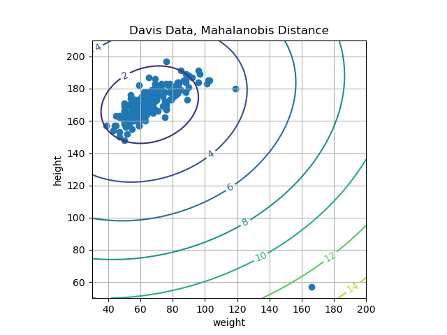

#### strange-attractor.py
カオス理論で出てくるストレンジアトラクター

#### ode.py
SIRによる感染モデル

#### mahalanobis.py
マハラノビス距離

[データー](https://www.kaggle.com/datasets/ravinduabey/davis-data-set)

#### gauss-newton.py
ガウス-ニュートン法

最終的なerrorのlog10を図示している
初期値に対して収束性がよくなっている

ガウス-ニュートン法(無修正)

レーベンバーグ・マーカート法

#### opencv-kmean.py
k-mean法によるクラス分類

k-mean++法を用いている

